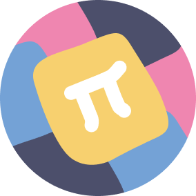

<p align="center">
  
  <br>
  <h1 align="center">Easy as π</h1>
</p>

The best way to learn new mathematical concepts is through practice. To this
end, students may work on exercises in their textbook, through in-class
assignments, or online. We believe these resources are lacking in that they
provide a finite number of exercises which may not be sufficient for a student
to fully understand a mathematical concept. Computer-generated mathematical
problems, problems following a particular template with generated numbers,
could an interesting area for innovation in this field. Combined with a
learning method known as spaced repetition, we think we have the ingredients
for an improved platform to teach mathematics.

## Development

To install and start developing on this project, run the following commands.

```shell
git clone https://github.com/qgolsteyn/easyaspi
cd easyaspi
yarn
```

From there, you can start the server and the client by running `yarn start` and
you can test the project by running `yarn test`.
